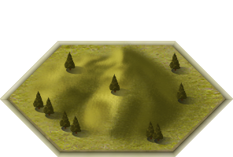
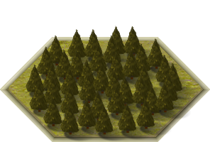
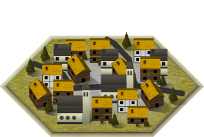

Game map
=============

.. |g| image:: _static/tiles/grass.png
    :width: 100pt

.. |m| image:: _static/tiles/mountain.png
    :width: 100pt

.. |r| image:: _static/tiles/river.png
    :width: 100pt

.. _terrains:

Map terrains
----------------

The game map is rugged and you can find various types of terrain on it. Some of them gives your units
bonuses but some of them will cause you hard moments in game strategy. Chose wise where you spawn your
defense, you cannot change it.

.. list-table:: **Field**
   :widths: 50 150

   * - |g|
     - **Description:** This to horizon stretching plane of yellow crop provides
       neither bonuses nor penalties. Just an opportunity to ruin another harvest

       **Bonus:** None

       **Penalty:** None

       **Sight cost:** 1

.. list-table:: **Hill**
   :widths: 50 150

   * - |h|
     - **Description:** Someone kept on throwing piles of dirt here and now look, there is a hill.
       There is a nice view.

       **Bonus:** Increases sight by 1, increase attack by 10% and defence by 10%

       **Penalty:** None

       **Sight cost:** half of remaining

.. list-table:: **Forest**
   :widths: 50 150

   * - |f|
     - **Description:** The shadows of the trees provide shelter from enemy arrows and the bushes make
       excellent place for an ambush. However, entering the forest might prove bit exhausting.

       **Bonus:** Increase defence by 20%

       **Penalty:** None

       **Sight cost:** 3

.. list-table:: **Mountain**
   :widths: 50 150

   * - |m|
     - **Description:** Everyone who tried climbing those knows, it is not a piece of cake.
       On the other hand, they provide great place to stay safe, since nobody wants to climb them either.

       **Bonus:** Increase defence by 50%, increase sight by 3

       **Penalty:** Decrease attack by 20%, lose 5% of max HP each round

       **Sight cost:** All

.. list-table:: **River**
   :widths: 50 150

   * - |r|
     - **Description:** Does not matter if it´s river, lake or pond, nobody wants to get wet.
       Especially not Larry (he cannot swim).

       **Bonus:** None

       **Penalty:** Decrease attack by 20%, decrease attack by 20%, decrease actions by 1

       **Sight cost:** 1

.. list-table:: **Village**
   :widths: 50 150

   * - |v|
     - **Description:** Little village in the countryside. Few huts, church and pub - everything a simple
       adventurer would need and even more!

       **Bonus:** Increase defense by 30%, increase actions by 1

       **Penalty:** None

       **Sight cost:** 1

.. _movement:

Map movement
----------------

Movement across the map could be sometimes hard. It is not easy to climb to the mountain, but when you are
starting on the mountain ridge, it is not that hard. Here you can see table with movements from
one type of the terrain to other one. The row describing starting terrain type and the column
represent target of your journey.

+--------------+-------+------+--------+-------+----------+---------+
|              | Field | Hill | Forest | River | Mountain | Village |
+==============+=======+======+========+=======+==========+=========+
| **Field**    | 1     | 2    | 2      | 2     | 3        | 1       |
+--------------+-------+------+--------+-------+----------+---------+
| **Hill**     | 2     | 1    | 2      | 2     | 2        | 2       |
+--------------+-------+------+--------+-------+----------+---------+
| **Forest**   | 1     | 2    | 1      | 2     | 3        | 1       |
+--------------+-------+------+--------+-------+----------+---------+
| **River**    | 2     | 3    | 3      | 1     | 4        | 2       |
+--------------+-------+------+--------+-------+----------+---------+
| **Mountain** | 3     | 3    | 3      | 3     | 2        | 3       |
+--------------+-------+------+--------+-------+----------+---------+
| **Village**  | 1     | 2    | 2      | 2     | 3        | 1       |
+--------------+-------+------+--------+-------+----------+---------+