GUI application
==================

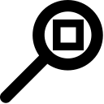

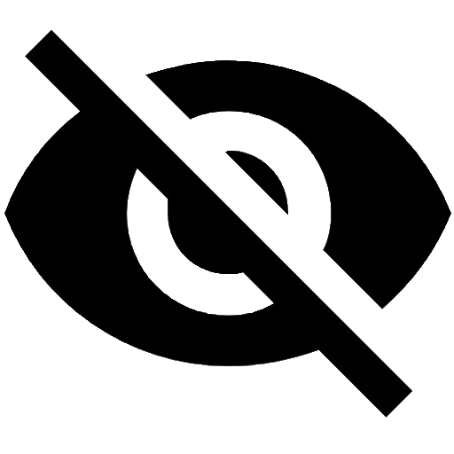

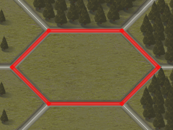

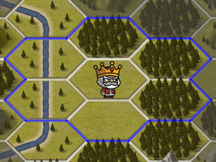

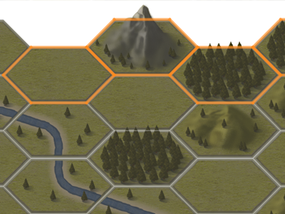

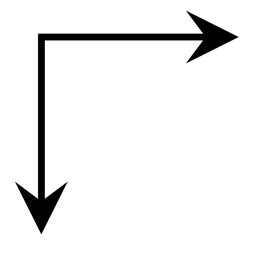

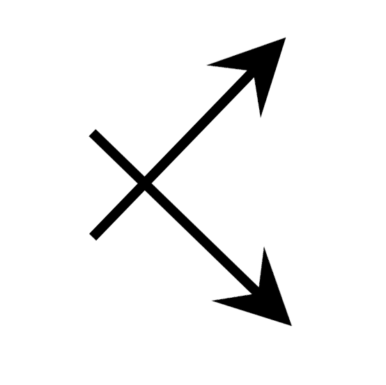

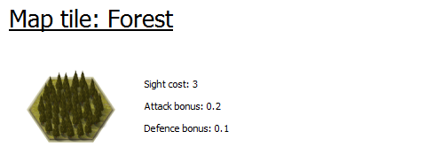

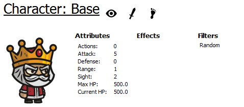

.. |show_visibility| image:: _static/icons/eye.png
    :width: 20pt
    :align: middle

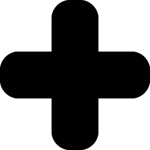

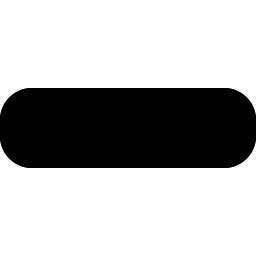

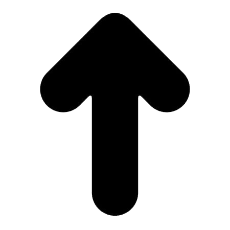

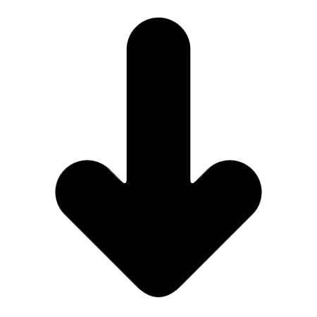

For the development purpose game is fully controllable from GUI application. You can start the application
from the root directory

.. code-block:: python

    python OrodaelTurrim

This command should open game main window and the game should be initialized.

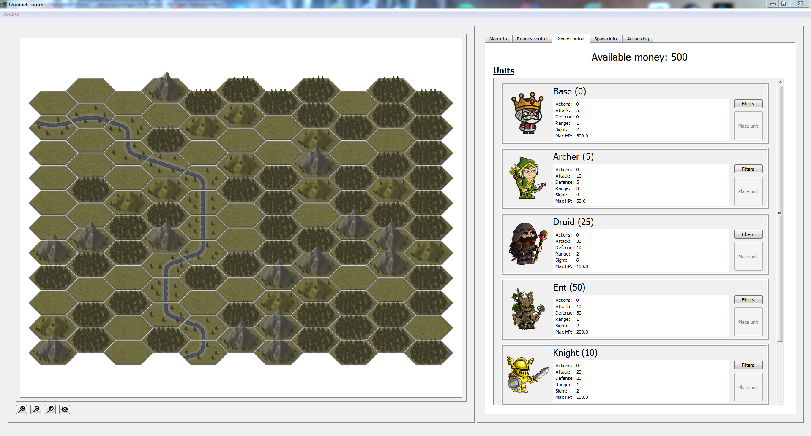

Main windows is divided to two parts, `Map widget` with the game map and `Tab widget` with all control and
information panels. You can change the sizes of each parts with central slider. Or you can also hide one of the widgets
by slide the widget to one side.

Map widget
-----------

Map widget displaying current state of the game. You can select each tile on the map and on the ``Map info`` tab you
can get information about that tile.

On the bottom of the map, there are 4 map control buttons

  * |zoom_in| - Zoom in the map
  * |zoom_out| - Zoom out the map
  * |zoom_reset| - Fit the map to the map widget size
  * |eye_cross| - Clear all borders and selections on the map

On the map there are three types of the borders

  * |select_red| - Currently selected position
  * |select_blue| - Attack, sight or move attack of selected unit
  * |select_orange| - Possible tiles of enemy spawn (always on the edge)

.. note::

   After spawn first unit you can also see that some tiles are grey and some not. Grey tiles represent positions
   that none of your units can see.

Map info tab
-----------------

On the `Map info widget` you can get information about selected tile and unit on that tile. This tab is empty until some
position is selected on the map.

**Position info**

 First part showing position in three types of representation. You can read about positions types at :ref:`positions`

  * |position_offset| - Offset position [ q r ]
  * |position_cubic| - Cubic position [ x y z ]
  * |position_axial| - Axial position [ q r ]

**Terrain info**

 Next part showing information about terrain on the selected position. You can see there some basic attributes
 of the tile. You can read more about terrain types at :ref:`terrains`

 |info_tile|

**Game object info**

 Last part of the widget displaying information about unit. This part is visible only if some game object
 is on currently selected position. You can see there information about unit attributes. If you select your own unit
 you can see also attack filters of this unit. You can read about attack filters at :ref:`filters`

 Game object info also have 3 buttons

  * |show_visibility| - show visibility of the unit on the map with blue border
  * |show_attack_range| - show attack range of the unit on the map with blue border
  * |show_move_range| - show move range of the unit on the map with blue border

 |info_character|

Round control tab
------------------------

On the Rounds control tab you can control game rounds and history browsing. Tab is divided to 4 parts

**Game info**
 First part displaying information about current game round (starting from 0) and current player.

**Player control**
 On the second parts there are two control buttons

 * `Run inference` - Execute one round of user inference (Create knowledge base, parse rules and run inference)
 * `End of round` - End your turn and execute attackers AI. After finished you will ba on the start of the next round.

**Auto combat**
 The next section is for simulating game rounds. You can specify simulation options

 * `Number of rounds` - How many rounds you want to simulate (you can't stop simulation until finished)
 * `Display process` - If you check this option, result of each round will be displayed on the map ( little bit slower )
 * `Delay` - Here you can specify time delay between rounds. This is useful when you are displaying process on the map.

**Browsing history**
 Last section is for browsing game history. With buttons `Previous turn` and `Next turn` you can browse game history.
 Current round will be displayed in the first part. When you are in the browsing mode, you cannot do any actions.

 Buttons always move to the start of the round of each player. So you can see what user can do in that round. In
 the log you can read what that user done. In browsing mode you can also see enemy point of view. This is allowed
 because of debugging. This game is not designed for competitive playing with UI, so find every information you want.

Game control tab
--------------------

With the `Game control tab` you can place units manually. So you can play the game with your mouse, but it is really
slow and noob method. So you should use `Game control tab` only for testing and debug purpose.

On the top you can see amount of resources you have. Under it there are your unit cards.

**Unit card**
 On the unit card you can see name of the unit with price in the brackets. Also there are basic unit attributes. If you
 want to know more about unit, you must look to the documentation.

 With the `Filters` button you can setup attack filters for the unit. `Place unit` button is disabled until you have
 selected available position on the map.

**Filter window**
 When you click on the `Filters` button, new window will open. Here you can specify which filters you want to use and
 the order of the filters. You can read about filter system here :ref:`filters`. There are 4 control buttons for filters

 * |filter_add| - Add filter to active filters
 * |filter_remove| - Remove filter from active filters
 * |filter_up| - Move current selected filter up (or you can use drag & drop)
 * |filter_down| - Move current selected filter down (or you can use drag & drop)

 Settings of active attack filters are persistent in one game session. So when you set up filters for one unit, this
 unit will always born with those active filters until you change configuration. Filters are unique for each unit.

Spawn info tab
-------------------

In the `Spawn info tab` you can obtain information about enemy planning spawn. You can read about your scouting at
:ref:`spawn`. For each known round there is part with list of unit and they anticipated positions. Your scouts are not
so good so there is information about position range and probability of positions. With the |show_visibility| you can
display positions on the map (orange borders).

Action log tab
-------------------

**TODO**