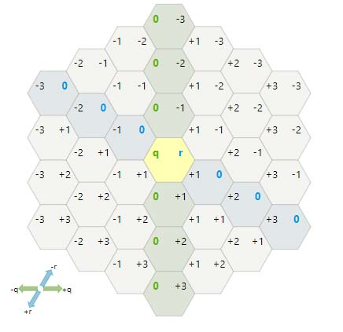
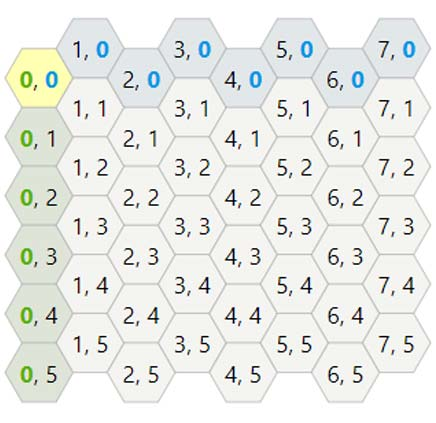
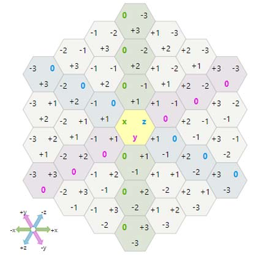
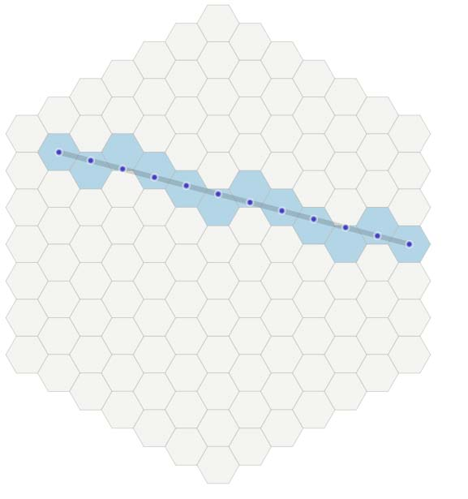
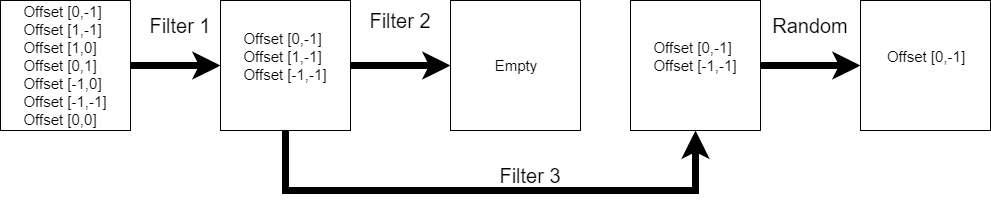

Game mechanisms
=====================

In the Orodael Turrim there are few mechanisms that are not standard for the games. Many of them are designed because
of expert system control and some of the are designed for this game. Also game using hex tile, where tile indexing
is not clear in the first look. So there are description of main game mechanisms.

.. _positions:

Positions types
------------------

Hex shape maps are commonly use in many games, but usually user don't need to index positions. In Orodael Turrim you
need to place units from the code so you need to understand position system. For indexing positions in hex maps
there are many systems, which some of them are faster for computing, some of them are more user readable. As a
compromise, I chose three three types of positions that is supported by framework, Cubic position, Offset position
and Axial position. You can chose any of them, which one is most understandable to you. In the code there are no
different between them.

Offset coordinates
*******************

The most common approach is to offset every other column or row. Columns are named col (q). Rows are named row (r).
Position [0 0] is in the center of the map, so positions on the left from the center have col (q) negative and
positions above the center have negative row (r).

|position_offset|

This is I think that offset is most understandable position system, but it is terrible for all computations.

Cubic coordinates
******************

Another way to look at hexagonal grids is to see that there are three primary axes, unlike the two we have for square
grids. There's an elegant symmetry with these. The cube coordinates are a reasonable choice for a hex grid coordinate
system. The constraint is that x + y + z = 0 so the algorithms must preserve that. The constraint also ensures
that there's a canonical coordinate for each hex.

|position_cubic|

This system is perfect for fast and simple operations, but could be hard to orient on the map for the user.
Also you need to save 3 numbers for each position.

Axial coordinates
*******************

The axial coordinate system, sometimes called “trapezoidal” or “oblique” or “skewed”, is built by taking two of the
three coordinates from a cube coordinate system. Since we have a constraint x + y + z = 0, there's some redundancy,
and we don't need to store all three coordinates. This diagram is the same as the previous one, but without y axis

|position_axial|

This system fix problem with 3 numbers in cubic coordinates system but it is more unreadable than cubic, so for
user no big deal.

.. note::

    All the information about position system is obtained from https://www.redblobgames.com/grids/hexagons/, so if
    you want to know more about hexagons systems you can read that page.

Unit actions
-----------------------

Movement over the map depends on the source terrain type, target terrain type and number of actions of the unit.
Some terrains are harder to cross then others. You can find table describing movements at :ref:`movement`. Actions of the
units describing only how far unit can go, each unit could attack only once per round. Unit don't need to spend all
the actions.

Note that defender units have 0 actions, so they can't move.

Sight
--------

Each unit have sigh, that describe how far it can see. Sight depend on the terrain that you standing on (for example
mountain gives you sight bonus) and on the tiles that you need to overlook. First constrain is that you always see
all your neighbour positions.

Computing for next positions is simple, create line from the center of starting position to the center of target
position. All tiles that line cross are added to sight computation. Each terrain type have own sight difficulty.
Algorithm start from the neighbor position, compute sight cost and continue to the next tile. Computation not include
starting position and target position. If remaining sight on the end is greater than zero, unit could see that position.
If the line hitting exact border of two hex tiles, algorithm try to use both and use better result.

|sight_line|

Attack range
--------------

Positions that unit could attack to are using same computation as sight but using attack range attribute.

Unit placing
----------------

When you are planning your defence you need to place units on the map. There are few restrictions about that

* You must place unit on visible tile ( Base could be spawned anywhere)
* Spawn tile must be empty
* You must have enough resources for that unit
* You can spawn only unit of your role (attacker / defender)
* As a defender, you can't spawn units on the map edge
* `For UI control, you can't spawn unit if you are in browsing mode`

When you are place unit, you must specify filters for unit (attack filters for both roles, mover filters only for
attackers). Unit filters are unchangeable after unit spawn, so think twice before you spawn your units.

Units could attack immediately after spawn, so you don't need to wait, also units can move immediately.

.. _filters:

Filters
-----------

For the unit movement and attacking, Orodael Turrim using filter system. Framework using filters because expert system
should define only unit spawn and don't need to decide attack strategy each turn. This is a great simplification for
expert system.

System of the filters are simple. Framework take all possible positions and start applying filters from the top.
Return value of the filter is sub-set of the positions. For each filter use there are described behaviour based
on the return value

 * If filter return empty positions set, this filter will not be used ( return to previous positions and use next one)
 * If filter return exactly one position, all remaining filter will not be used (not necessary)
 * If in the set left more than one position after usage of all filters, framework chose on position randomly.

Filters have access to game proxy, so it can use information about terrain, unit attributes and other. User
could write own filters, this functionality is described at :ref:`custom_filters`. Filters for move actions and
attack actions are same only using different starting set of positions (accessible tiles for move and tiles based
on attack range for attack).

|filters|

.. _spawn:

Attacker spawn information
-----------------------------

In the game, you can obtain information about incoming enemies. Unfortunately, your spies are not among the elite,
so the information is not exactly accurate. Your spies trying to get the best information each round, so each round
you can get better information.

The system is simple, each round spies try to get the best information about incoming enemies. Each round is more or
less successful. If they are successful more than the previous turn, information about incoming enemies are improved.
If scouts have a bad day, they only send you information about unknown incoming units. Also, there is some probability,
that units change direction at the last moment.

The result of this is a list of information for N rounds (N is defined by current AI module). Each round that information
is best what you can have. This information includes the type of upcoming unit and a list of fields where they
can appear in the future. The distribution of probabilities between fields is justified.

It is up to you whether you will trust your Scouts or just use the well known information.

