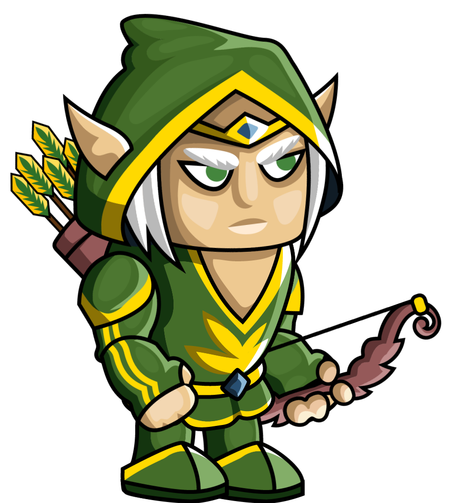
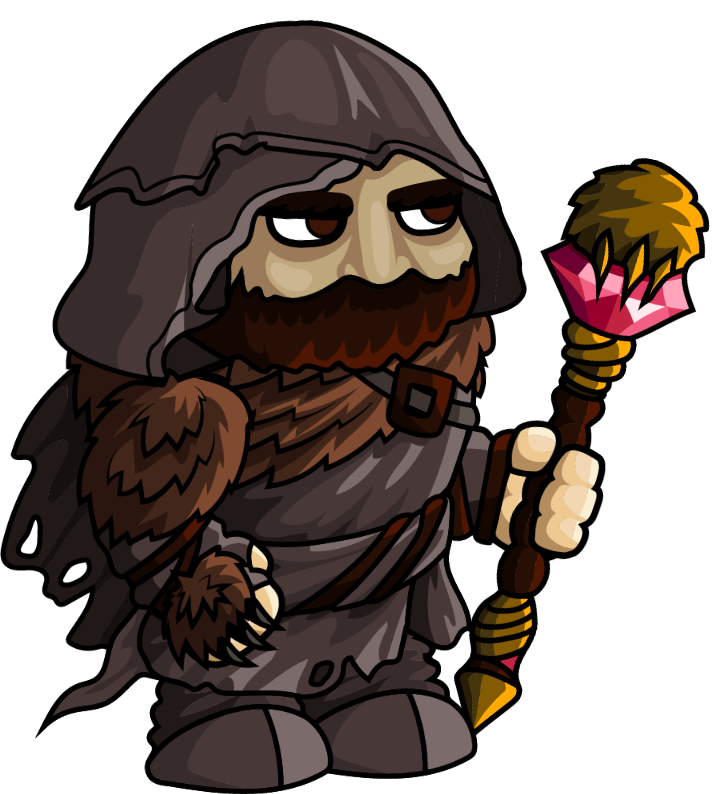
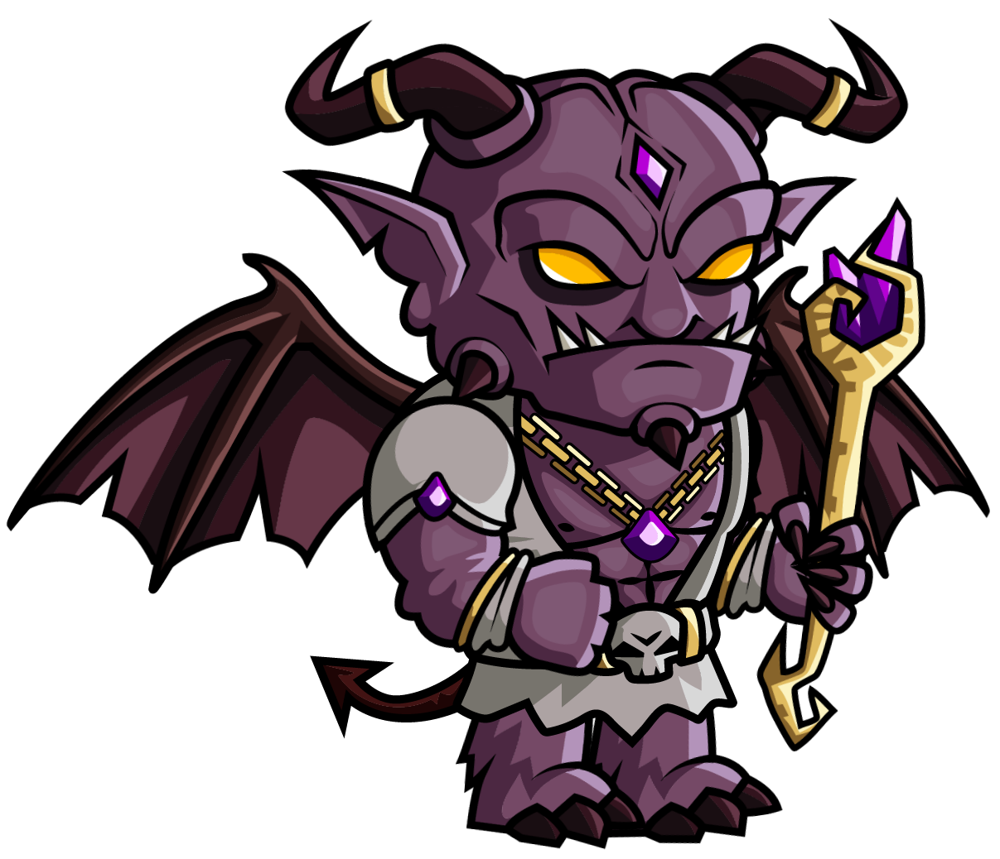
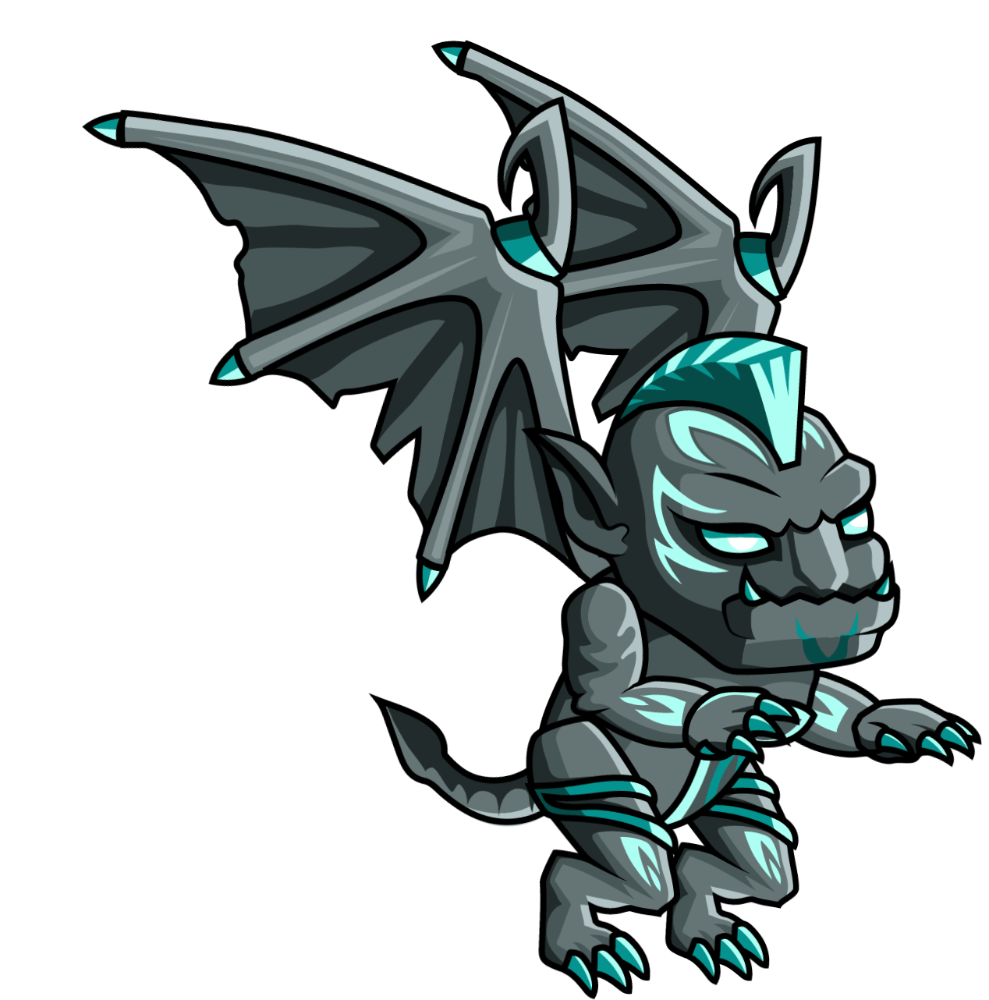

Units
========

Defenders
-------------

You can you any of this units. Some of them are really helpful, some of them not really.
But you will use them probably.

.. |wizard| image:: _static/units/mage.png
    :width: 100pt
    :align: middle

.. |ent| image:: _static/units/ent.png
    :width: 100pt

.. |knight| image:: _static/units/knight.png
    :width: 100pt
    :align: middle

.. list-table:: **Knight**
   :widths: 50 150

   * - |knight|
     - **Attack:** 15

       **Defense:** 12

       **Sight:** 2

       **Price:** 12

       **Lives:** 80

       **Attack range:** 1

       **Active ability:** Large shiny shield - Blind

       **Passive ability:** Heavy armor - Root resistance

.. list-table:: **Magician**
   :widths: 50 150

   * - |wizard|
     - **Attack:** 40

       **Defense:** 5

       **Sight:** 3

       **Price:** 30

       **Lives:** 75

       **Attack range:** 2

       **Active ability:** Fireball - Burn

       **Passive ability:** Flame-proof  cloak - Burn resistance

.. list-table:: **Archer**
   :widths: 50 150

   * - |archer|
     - **Attack:** 10

       **Defense:** 1

       **Sight:** 4

       **Price:** 5

       **Lives:** 30

       **Attack range:** 3

       **Active ability:** -

       **Passive ability:** Blind resistance

.. list-table:: **Ent**
   :widths: 50 150

   * - |ent|
     - **Attack:** 10

       **Defense:** 15

       **Sight:** 2

       **Price:** 50

       **Lives:** 250

       **Attack range:** 1

       **Active ability:** Nature harmony - Root

       **Passive ability:** Hard bark - Freeze resistance

.. list-table:: **Druid**
   :widths: 50 150

   * - |druid|
     - **Attack:** 30

       **Defense:** 5

       **Sight:** 5

       **Price:** 25

       **Lives:** 100

       **Attack range:** 2

       **Active ability:** Solid winter - freeze

       **Passive ability:** -

Attackers
------------

Rigor Mortis servants. You need to show them who is the King here.

.. |e| image:: _static/units/elemental.png
    :width: 100pt

.. |m| image:: _static/units/minotaur.png
    :width: 100pt

.. |n| image:: _static/units/nekromancer.png
    :width: 100pt

.. |o| image:: _static/units/orc.png
    :width: 100pt

.. list-table:: **Cyclops**
   :widths: 50 150

   * - |c|
     - **Attack:** 20

       **Defense:** 10

       **Sight:** 3

       **Price:** 60

       **Lives:** 80

       **Attack range:** 2

       **Active ability:** -

       **Passive ability:** Hard skin - Burn resistance

       **Actions:** 2

.. list-table:: **Daemon**
   :widths: 50 150

   * - |d|
     - **Attack:** 35

       **Defense:** 5

       **Sight:** 3

       **Price:** 80

       **Lives:** 150

       **Attack range:** 3

       **Active ability:** Fireball - burn

       **Passive ability:** Magical immune - burn and freeze resistance

       **Actions:** 2

.. list-table:: **Elemental**
   :widths: 50 150

   * - |e|
     - **Attack:** 12

       **Defense:** 10

       **Sight:** 2

       **Price:** 35

       **Lives:** 60

       **Attack range:** 2

       **Active ability:** Flame body - burn

       **Passive ability:** Flame body - burn

       **Actions:** 3

.. list-table:: **Gargoyle**
   :widths: 50 150

   * - |g|
     - **Attack:** 10

       **Defense:** 10

       **Sight:** 5

       **Price:** 30

       **Lives:** 60

       **Attack range:** 2

       **Active ability:** -

       **Passive ability:** Stone skin - freeze resistance

       **Actions:** 3

.. list-table:: **Minotaur**
   :widths: 50 150

   * - |m|
     - **Attack:** 15

       **Defense:** 20

       **Sight:** 2

       **Price:** 50

       **Lives:** 150

       **Attack range:** 1

       **Active ability:** -

       **Passive ability:** Strong legs - root resistance

       **Actions:** 2

.. list-table:: **Necromancer**
   :widths: 50 150

   * - |n|
     - **Attack:** 20

       **Defense:** 5

       **Sight:** 3

       **Price:** 50

       **Lives:** 75

       **Attack range:** 2

       **Active ability:** -

       **Passive ability:** Levitation - root resistance

       **Actions:** 3

.. list-table:: **Orc**
   :widths: 50 150

   * - |o|
     - **Attack:** 8

       **Defense:** 5

       **Sight:** 3

       **Price:** 8

       **Lives:** 35

       **Attack range:** 1

       **Active ability:** -

       **Passive ability:** -

       **Actions:** 2

.. list-table:: **Skeleton**
   :widths: 50 150

   * - |s|
     - **Attack:** 5

       **Defense:** 2

       **Sight:** 3

       **Price:** 5

       **Lives:** 20

       **Attack range:** 1

       **Active ability:** -

       **Passive ability:** No eyes - blind protection

       **Actions:** 2
 

Effects
---------

In the game, there are several effects that can inflict your or enemy unit. Some unit are resistant to that effects,
so pick target unit wisely when you are attacking.

.. list-table:: **Burn**
   :widths: 50 150

   * - |f|
     - **Description:** Burning, effectively reducing hit points over time. Ssssmokin.

       **Effect:** Losing 5 lives per round

.. list-table:: **Freeze**
   :widths: 50 150

   * - |fr|
     - **Description:** Freezing unit cannot move so fast. Like ... soooo cool

       **Effect:** Reduce move actions to half

.. list-table:: **Root**
   :widths: 50 150

   * - |r|
     - **Description:** When object is rooted and therefore not able to inflict so much damage. Groot, is that you?

       **Effect:** Reduce attack to half

.. list-table:: **Blind**
   :widths: 50 150

   * - |b|
     - **Description:** So bright light. It is take a time until you normal sight

       **Effect:** Reduce sight to half

